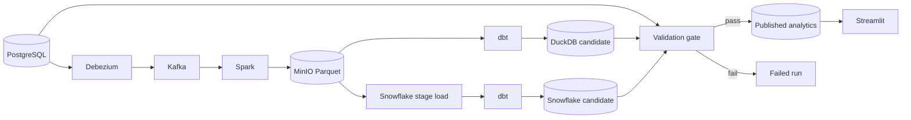
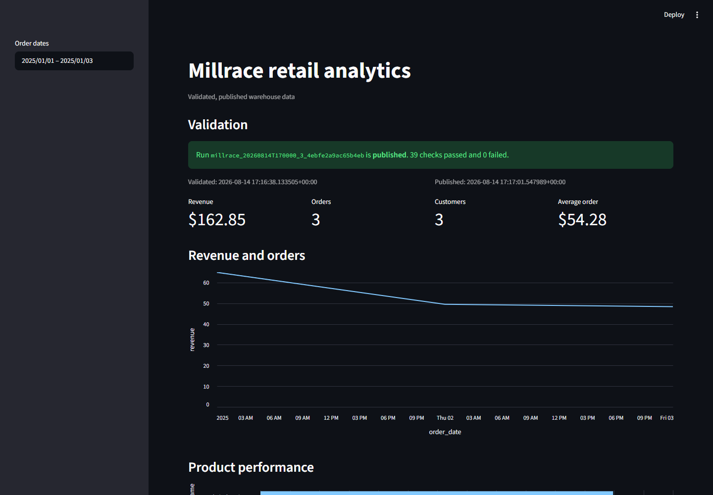

# Millrace

Millrace is a Kafka-to-warehouse ELT project with source-to-target validation. It moves retail
change data from PostgreSQL through Debezium and Kafka, processes it with Spark Structured
Streaming, stores partitioned Parquet in MinIO, and builds star-schema marts with dbt against
DuckDB and, as a supplementary target, Snowflake. Airflow coordinates repeatable loads and
backfills on the DuckDB path; the Snowflake path runs through the same orchestration functions via
a CLI backfill today (see [Roadmap](#roadmap)).

The publication gate compares row counts, deterministic column checksums, business aggregates, and
delete propagation at one source batch cutoff, independently against source history rather than
against either warehouse. A mismatch fails the run and leaves the last validated dataset
published. When both targets are enabled, `python -m millrace.validation compare` runs the same
gate against DuckDB and Snowflake from the identical source snapshot and reports where the two
disagree.

## Architecture





## What it demonstrates

- CDC handling for inserts, updates, deletes, tombstones, and replayed events
- Bounded Structured Streaming runs with durable Kafka checkpoints
- Immutable bronze data and deterministic silver snapshots in Parquet
- Incremental dbt models for conformed dimensions and order facts
- Fail-closed source-to-target reconciliation before publication
- Idempotent Airflow retries and date-partition backfills
- Structured logs, Prometheus metrics, and business and operations dashboards

## Prerequisites

- Docker Desktop with at least 10 GB of memory available
- Docker Compose v2 or later
- `uv` for local Python checks

## Quick start

Copy `.env.example` to `.env`, then start the stack:

```powershell
./scripts/bootstrap.ps1 -Dashboard -Monitoring
./scripts/demo.ps1
uv run pytest tests/e2e -m e2e
```

On macOS or Linux:

```bash
./scripts/bootstrap.sh --dashboard --monitoring
./scripts/demo.sh
uv run pytest tests/e2e -m e2e
```

The scripts print the local Airflow, Streamlit, Grafana, MinIO, and Kafka UI endpoints after the
services become healthy.

## Local quality checks

```bash
uv sync --extra dev --extra dbt --extra dashboard --extra snowflake
uv run ruff check .
uv run pyright
uv run pytest tests/unit --cov
uv run dbt parse --project-dir dbt --profiles-dir dbt --target candidate
uv run dbt parse --project-dir dbt --profiles-dir dbt --target snowflake_candidate
uv run sqlfluff lint dbt/models dbt/tests
docker compose config --quiet
```

Linting the Snowflake dialect (`sqlfluff lint --config .sqlfluff.snowflake ...`) and everything
past `dbt parse` on that target needs a live Snowflake connection, so it runs only in the
credential-gated `snowflake-cross-engine` CI job, not in local quality checks by default.

The full containerized test and failure-injection workflows are described in
[docs/demo.md](docs/demo.md). Design decisions and data contracts are in
[docs/architecture.md](docs/architecture.md).

## Safety properties

Each run writes to an isolated candidate schema and object prefix. Validation reads source history
and target data at the same `batch_id`. Stable analytics views change in one transaction only
after all configured checks and dbt tests pass. Failed candidates remain available for diagnosis
without changing the dashboard dataset.

## Project status

The deterministic DuckDB stack has completed clean golden and failure-injection runs. The verified
published dataset contains three customers, four products, three orders, and six order items.
See [docs/demo.md](docs/demo.md) for measured task timings and the demonstration procedure.

Snowflake support has completed a clean run against a real Snowflake account: silver Parquet
loaded through an internal stage and `COPY INTO`, `dbt-snowflake` build, all 43 oracle checks
passed, atomic promotion via `ALTER SCHEMA ... SWAP WITH`, and a cross-engine `compare` run
against the identical Postgres source snapshot showing zero disagreements with DuckDB. The
failure-injection precision and publish-atomicity properties proven on DuckDB were independently
reproduced on Snowflake: corrupting one value fails exactly the one matching check
(`checksum:email`) out of 43, and a failed report is refused before touching the published
`analytics` schema.

## Roadmap

- **Snowflake warehouse target**: verified against a live account (see Project status above).
  The credential-gated `snowflake-cross-engine` CI job (`.github/workflows/e2e.yml`) exercises the
  same path continuously; it runs only when Snowflake secrets are configured in the repository.
- **BigQuery, Databricks, and Redshift warehouse targets**: not started. The warehouse seam
  (`src/millrace/warehouse/`, `Dialect`, `WarehouseGateway`) exists to make adding one of these a
  matter of a new dialect and gateway plus reader/audit/publication classes, not a rewrite.
- **Schema registry and compatibility gating**: not started.
- **CDC-lag and freshness observability**: not started.
- **Incremental reconciliation**: not started; full-table hashing runs on every batch today.
- **Flink materialization**: not started, optional alternative to Spark Structured Streaming.
