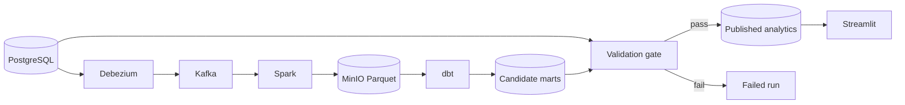

# Millrace

Millrace is a Kafka-to-warehouse ELT project with source-to-target validation. It moves retail
change data from PostgreSQL through Debezium and Kafka, processes it with Spark Structured
Streaming, stores partitioned Parquet in MinIO, and builds star-schema marts with dbt and DuckDB.
Airflow coordinates repeatable loads and backfills.

The publication gate compares row counts, deterministic column checksums, and business aggregates
at one source batch cutoff. A mismatch fails the run and leaves the last validated dataset
published.

## Architecture




## What it demonstrates

- CDC handling for inserts, updates, deletes, tombstones, and replayed events
- Bounded Structured Streaming runs with durable Kafka checkpoints
- Immutable bronze data and deterministic silver snapshots in Parquet
- Incremental dbt models for conformed dimensions and order facts
- Fail-closed source-to-target reconciliation before publication
- Idempotent Airflow retries and date-partition backfills
- Structured logs, Prometheus metrics, and business and operations dashboards

## Prerequisites

- Docker Desktop with at least 10 GB of memory available
- Docker Compose v2 or later
- `uv` for local Python checks

## Quick start

Copy `.env.example` to `.env`, then start the stack:

```powershell
./scripts/bootstrap.ps1 -Dashboard -Monitoring
./scripts/demo.ps1
uv run pytest tests/e2e -m e2e
```

On macOS or Linux:

```bash
./scripts/bootstrap.sh --dashboard --monitoring
./scripts/demo.sh
uv run pytest tests/e2e -m e2e
```

The scripts print the local Airflow, Streamlit, Grafana, MinIO, and Kafka UI endpoints after the
services become healthy.

## Local quality checks

```bash
uv sync --extra dev --extra dbt --extra dashboard
uv run ruff check .
uv run pyright
uv run pytest tests/unit --cov
uv run dbt parse --project-dir dbt --profiles-dir dbt
uv run sqlfluff lint dbt/models dbt/tests
docker compose config --quiet
```

The full containerized test and failure-injection workflows are described in
[docs/demo.md](docs/demo.md). Design decisions and data contracts are in
[docs/architecture.md](docs/architecture.md).

## Safety properties

Each run writes to an isolated candidate schema and object prefix. Validation reads source history
and target data at the same `batch_id`. Stable analytics views change in one transaction only
after all configured checks and dbt tests pass. Failed candidates remain available for diagnosis
without changing the dashboard dataset.

## Project status

The deterministic stack has completed clean golden and failure-injection runs. The verified
published dataset contains three customers, four products, three orders, and six order items.
See [docs/demo.md](docs/demo.md) for measured task timings and the demonstration procedure.
