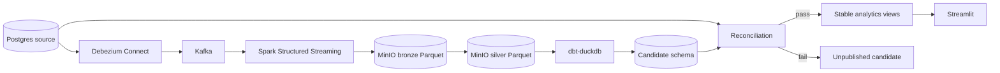

# Architecture

Millrace is a locally runnable retail change data capture pipeline. It keeps ingestion,
transformation, validation, and publication as separate stages so a failed run cannot expose
partial data.

## Data flow



## Run contract

Each source transaction belongs to a monotonically increasing `batch_id`. Immutable history
tables retain source versions and deletes. A pipeline run captures a closed batch cutoff and
uses `(data_interval_start, data_interval_end, batch_id)` as its stable identity.

Run states are `created`, `ingesting`, `transforming`, `validating`, `published`, or `failed`.
Only the validation task can authorize publication. Publication changes stable DuckDB views in
one transaction and records the published run in the control schema.

## Storage contract

- Bronze stores decoded CDC events without destructive updates.
- Silver stores deterministic entity state as of a batch cutoff.
- Candidate schemas contain dbt models for one run.
- Stable `analytics` views point at the last validated candidate.
- Checkpoints are isolated by pipeline and source topic.
- Dead-letter events include topic, partition, offset, payload, and a reason code.

Object keys use this layout:

```text
s3://millrace/bronze/table=<table>/event_date=<date>/part-*.parquet
s3://millrace/silver/run_id=<run_id>/table=<table>/part-*.parquet
s3://millrace/reports/run_id=<run_id>/reconciliation.json
```

## Reconciliation contract

Validation compares the source history and candidate target at the same batch cutoff:

1. Row counts per entity and configured partition.
2. Per-column checksums after canonical null, text, date, timestamp, decimal, and Boolean
   normalization.
3. Domain aggregates such as order totals, item quantities, minima, maxima, and grouped revenue.

Every configured check must pass. Missing data, missing rules, query errors, and mismatches all
fail closed. A failed run retains diagnostics and never changes the published views.

## Compatibility baseline

- Python 3.11
- Apache Spark 4.0
- Apache Airflow 3.1
- dbt Core 1.10 with dbt-duckdb 1.10
- DuckDB 1.4
- PostgreSQL 16
- Kafka 3.9 in KRaft mode
- Debezium 3.2

Container tags and Python versions are pinned in executable configuration. Upgrades require the
unit suite, DAG import test, dbt parse, Compose health check, and golden end-to-end run.

## Operational constraints

DuckDB supports one writer for this deployment, so the Airflow DAG allows one active run.
Backfills read archived bronze partitions and do not rely on Kafka retention. Retries reuse stable
paths and keys. Secrets are supplied through environment variables and never stored in artifacts
or logs.
