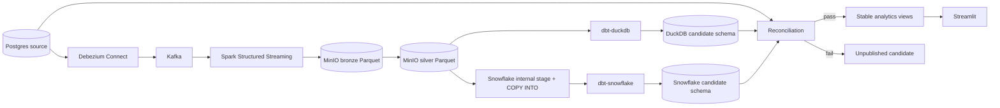

# Architecture

Millrace is a locally runnable retail change data capture pipeline. It keeps ingestion,
transformation, validation, and publication as separate stages so a failed run cannot expose
partial data.

## Data flow



DuckDB reads the silver Parquet directly through httpfs at query time. Snowflake cannot do that, so
a load stage (`millrace.warehouse.snowflake_target.load_silver`) downloads the same silver Parquet
objects and loads them through an internal stage with `PUT` + `COPY INTO`, asserting the loaded row
count against the Parquet row count before dbt runs. Both targets therefore read byte-identical
source bytes, which is what makes a DuckDB/Snowflake disagreement attributable to the warehouse and
not to the snapshot.

## Run contract

Each source transaction belongs to a monotonically increasing `batch_id`. Immutable history
tables retain source versions and deletes. A pipeline run captures a closed batch cutoff and
uses `(data_interval_start, data_interval_end, batch_id)` as its stable identity.

Run states are `created`, `ingesting`, `transforming`, `validating`, `published`, or `failed`.
Only the validation task can authorize publication. On DuckDB, publication changes stable views in
one transaction and records the published run in the control schema. Snowflake DDL auto-commits,
so that single-transaction swap is not available there; see "Publication atomicity" below for how
the Snowflake path gets the same all-or-nothing guarantee a different way.

## Storage contract

- Bronze stores decoded CDC events without destructive updates.
- Silver stores deterministic entity state as of a batch cutoff.
- Candidate schemas contain dbt models for one run, one set per enabled warehouse target.
- Stable `analytics` views (DuckDB) or the `analytics` schema (Snowflake) point at the last
  validated candidate for that target.
- Checkpoints are isolated by pipeline and source topic.
- Dead-letter events include topic, partition, offset, payload, and a reason code.

Object keys use this layout:

```text
s3://millrace/bronze/table=<table>/event_date=<date>/run_id=<run_id>/stream_batch_id=<20-digit>/part-*.parquet
s3://millrace/bronze/dead_letter/table=<table>/run_id=<run_id>/stream_batch_id=<20-digit>/part-*.parquet
s3://millrace/silver/run_id=<run_id>/table=<table>/part-*.parquet
s3://millrace/reports/run_id=<run_id>/reconciliation.json
```

The Snowflake raw schema for a run (`RAW_<run suffix>`, see
`millrace.warehouse.snowflake_target.raw_schema`) holds a direct load of that same silver Parquet,
loaded via an internal stage rather than read in place.

## Reconciliation contract

Validation compares the source history and candidate target at the same batch cutoff:

1. Row counts per entity and configured partition.
2. Per-column checksums after canonical null, text, date, timestamp, decimal, and Boolean
   normalization. Decimals are compared after `Decimal.normalize()` strips trailing zeros, not
   against a configured fixed scale, which is what lets a DuckDB `DECIMAL(18,2)` column and a
   Snowflake `NUMBER(38,9)` column agree despite declaring different scales.
3. Domain aggregates such as order totals, item quantities, minima, maxima, and grouped revenue,
   computed in Python over the fetched rows rather than pushed down as SQL, so the two engines
   cannot disagree by way of SQL aggregate semantics.
4. Delete propagation: a business key tombstoned in source history must not still exist in the
   target. This runs as an explicit check per entity, not just as an implied row-count/checksum
   mismatch.

Every configured check must pass. Missing data, missing rules, query errors, and mismatches all
fail closed. A failed run retains diagnostics and never changes the published views.

When more than one warehouse target is enabled, `python -m millrace.validation compare` runs this
same gate against each target from one cached read of source history (so both targets are
compared against literally the same rows, not two independent reads that could race a concurrent
source write) and reports any check where the targets disagree, in addition to each target's own
pass/fail result.

## Publication atomicity

DuckDB wraps the whole publish (the four authorization gates, swinging every published view, and
recording the publication) in one transaction (`PromotionService`), so a failure partway through
leaves the previously published views untouched; `tests/unit/validation/test_publication.py`
proves this by forcing a failure on the second of two views and asserting the first is unchanged.

Snowflake DDL commits as it runs, so that loop is not available there. `SnowflakePromotionService`
instead builds every publication view into a staging schema, then promotes all of them at once
with `ALTER SCHEMA analytics SWAP WITH analytics_staging`, one atomic statement. Because the
`publication_runs` insert can no longer share a transaction with that swap, it becomes two-phase:
a `pending` row is written before the swap and updated to `published` after. A crash between those
two steps leaves the recorded published batch lagging the swapped-in views, never ahead of them,
and the next promotion attempt for the same run resumes rather than re-inserting. The
monotonicity gate counts only `published` rows, so an abandoned `pending` row cannot permanently
block a lower batch from publishing later.

`ALTER SCHEMA ... SWAP WITH` swaps the schema wholesale, and the staging schema it swaps out is
then dropped. **On the Snowflake target, `analytics` is owned exclusively by this pipeline**:
anything else created there by hand is destroyed on the next promotion, and schema-level grants
follow the swapped-out schema rather than persisting. This is the cost of getting a genuine
all-or-nothing publish on an engine whose DDL cannot be rolled back; per-view replacement would
preserve unrelated objects but would reintroduce exactly the half-published window the DuckDB
path is transactional to avoid. Put nothing else in `analytics`, and grant on the database or on
the individual views rather than on the schema.

## Cross-engine SQL portability

`dbt/macros/portability.sql` holds the constructs that differ between the two engines: date-key
formatting (`strftime` vs `to_char`), timestamp casts (`timestamptz` vs `timestamp_tz`), and the
date spine (`generate_series` vs `GENERATOR` + `DATEADD`).

Two of these change meaning rather than just syntax, so they are pinned to one canonical form
instead of each engine's default:

- `day_of_week` on `dim_date` is ISO (Monday=1 through Sunday=7) on both targets, via `isodow()`
  on DuckDB and `dayofweekiso()` on Snowflake. **This changed the published column's encoding**:
  it was previously DuckDB's `dayofweek()`, which is Sunday=0 through Saturday=6. Snowflake's
  `dayofweek()` is governed by the session `WEEK_START` parameter, so neither engine's default
  was safe to publish. `is_weekend` is derived from the ISO values (6, 7) accordingly.
- `day_name` and `month_name` come from a literal lookup on the numeric day/month rather than
  `dayname()`/`monthname()`, which return full names on DuckDB and three-letter abbreviations on
  Snowflake. The lookup is also locale-independent.

## Compatibility baseline

- Python 3.11
- Apache Spark 4.0
- Apache Airflow 3.1
- dbt Core 1.10 with dbt-duckdb 1.10 and, for the supplementary Snowflake target, dbt-snowflake
  1.10 and snowflake-connector-python
- DuckDB 1.4
- PostgreSQL 16
- Kafka 3.9 in KRaft mode
- Debezium 3.2

Container tags and Python versions are pinned in executable configuration. Upgrades require the
unit suite, DAG import test, dbt parse, Compose health check, and golden end-to-end run.

## Operational constraints

DuckDB supports one writer for this deployment, so the Airflow DAG allows one active run. This
constraint is specific to DuckDB; Snowflake does not share it, but the Airflow DAG does not yet
orchestrate the Snowflake path either. Today Snowflake runs through
`python -m millrace.orchestration backfill-run --warehouse snowflake`, which calls the same
`build_candidate` / `validate_candidate` / `promote_candidate` functions the DAG's tasks call, just
from a CLI rather than from a DAG task. Wiring a Snowflake branch into the DAG itself is
unstarted; see [Roadmap](../README.md#roadmap).

Backfills read archived bronze partitions and do not rely on Kafka retention. Retries reuse stable
paths and keys. Secrets are supplied through environment variables and never stored in artifacts
or logs. Snowflake credentials follow the same rule: `MILLRACE_SNOWFLAKE_*` environment variables,
never a tracked file.
